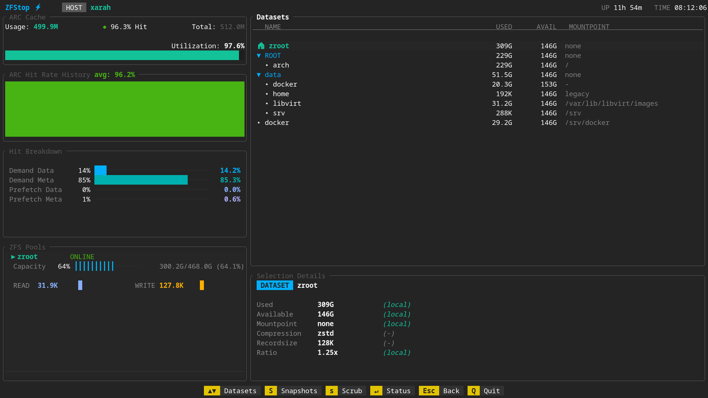
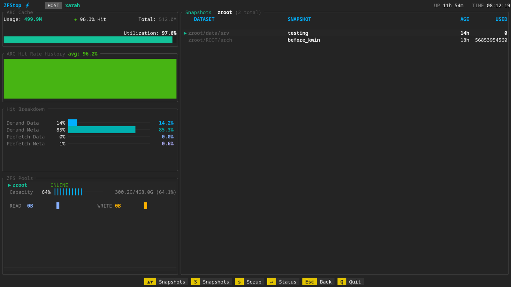
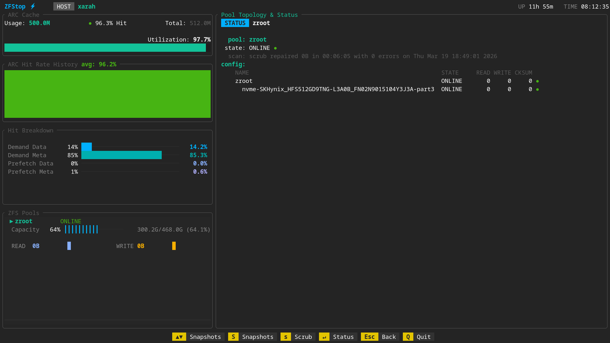

# zfstop


A fast, keyboard-driven **Terminal UI dashboard for ZFS**.

Monitor pools, browse datasets, inspect status, and manage snapshots — all in a clean TUI.

---

## ✨ Features

<p align="center">
    
    
</p>
<p align="center">
    
</p>

### 📊 Monitoring

* ZFS pool overview (health, capacity, IO)
* ARC stats (usage, hit rate, breakdown)
* Live utilization indicators

### 📁 Datasets

* Hierarchical dataset browser
* Used / available / mountpoint view
* Selection details panel

### 📸 Snapshots

* List snapshots per dataset
* Create snapshots (interactive popup)
* Snapshot metadata (age, used space)

### 🔧 Pool Status

* Full `zpool status` view
* Device topology
* Scrub/resilver info

### ⌨️ UX

* Fully keyboard-driven
* Clean layout inspired by tools like `k9s` / `lazygit`
* Context-aware panels
* Lightweight and fast (Rust + ratatui)

---

## 📦 Installation

### From source

```bash
git clone https://github.com/yourusername/zfstop
cd zfstop
cargo build --release
```

```bash
./target/release/zfstop
```

---

### Packages (WIP)

Packaging configs are available for:

* Arch Linux
* Debian / Ubuntu
* Alpine
* RPM-based distros

---

## 🔑 Keybindings

| Key   | Action               |
| ----- | -------------------- |
| ↑ / ↓ | Navigate lists       |
| j / k | Navigate (vim-style) |
| Enter | Open / confirm       |
| s     | Open snapshots view  |
| c     | Create snapshot      |
| Esc   | Back / cancel        |
| q     | Quit                 |

---

## 🔐 Permissions

Creating snapshots requires appropriate ZFS permissions.

### Option 1: Run as root

```bash
sudo zfstop
```

### Option 2 (recommended): delegate permissions

```bash
sudo zfs allow <user> snapshot <dataset>
```

Example:

```bash
sudo zfs allow oxy snapshot zroot/data
```

---

## 🏗️ Project Structure

```
src/
 ├── main.rs        # entry point
 ├── app.rs         # state management
 ├── ui/            # UI rendering
 │   ├── mod.rs
 │   ├── datasets.rs
 │   ├── snapshots.rs
 │   └── status.rs
 ├── zfs/           # ZFS interaction layer
 │   ├── pools.rs
 │   ├── datasets.rs
 │   ├── snapshots.rs
 │   └── status.rs
 └── utils.rs
```

---

## 🚧 Status

Active development — features and UI are evolving.

---

## 📄 License

This project is licensed under either of:

* MIT License
